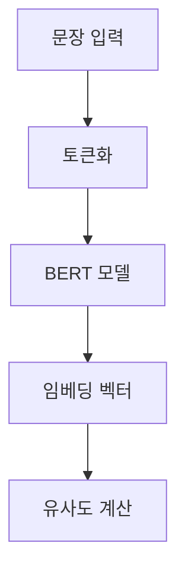

# 🤖 자연어 처리(NLP) 학습 일지 - Day 1

## 📚 오늘의 학습 내용
1. 감정 분석 (Sentiment Analysis)
2. 단어 임베딩 (Word Embedding)
3. BERT를 이용한 문장 유사도 분석
4. IMDB 데이터셋을 활용한 감정 분석 모델 학습

---

## 1️⃣ 감정 분석 실습
### 🎯 목표
- Hugging Face의 Transformers 라이브러리를 사용하여 텍스트의 감정을 분석
- 기본 모델과 RoBERTa 모델의 성능 비교

### 📝 코드 및 설명
```python
from transformers import pipeline

# 기본 감정 분석
sentiment_analysis = pipeline("sentiment-analysis")
result = sentiment_analysis("I hate using Hugging Face!")

# RoBERTa 기반 감정 분석
classifier = pipeline("sentiment-analysis", model="roberta-base")
result = classifier("This product is amazing!")
```

> 💡 **알아두면 좋은 점**
> - pipeline은 손쉽게 NLP 작업을 수행할 수 있게 해주는 도구
> - RoBERTa는 BERT를 개선한 모델

---

## 2️⃣ 단어 임베딩 실습
### 🎯 목표
Word2Vec을 사용하여 단어 간의 관계성 파악

### 📊 실습 구조


### 📝 주요 코드
```python
from gensim.models import Word2Vec

model = Word2Vec(sentences=processed, 
                vector_size=5,
                window=5,
                min_count=1, 
                sg=0)
```

> 🔍 **파라미터 설명**
> - vector_size: 임베딩 벡터의 차원
> - window: 문맥 윈도우 크기
> - min_count: 최소 단어 등장 횟수
> - sg: 학습 알고리즘 선택 (0: CBOW, 1: Skip-gram)

---

## 3️⃣ BERT 문장 임베딩
### 🎯 목표
BERT를 사용하여 문장 간 유사도 측정

### 🔄 처리 과정
1. BERT 모델 및 토크나이저 로드
2. 문장 토큰화
3. 임베딩 생성
4. 코사인 유사도 계산

### 📊 시각화


---

## 4️⃣ IMDB 리뷰 감정 분석
### 🎯 목표
BERT를 사용하여 영화 리뷰 감정 분석 모델 학습

### 📈 학습 과정
1. 데이터셋 로드 및 전처리
2. BERT 모델 설정
3. 학습 파라미터 설정
4. 모델 학습 및 평가

### ⚙️ 주요 설정
```python
training_args = TrainingArguments(
    output_dir='./results',
    num_train_epochs=3,
    per_device_train_batch_size=8,
    evaluation_strategy="epoch"
)
```

---

## 📌 오늘의 핵심 포인트
1. 트랜스포머 기반 모델들의 강력한 성능
2. 단어/문장 임베딩의 중요성
3. 사전학습 모델의 활용 방법

## 🔜 다음 학습 계획
- [ ] 다양한 언어에 대한 감정 분석
- [ ] 모델 성능 최적화
- [ ] 커스텀 데이터셋 활용

---

## 📚 참고 자료
- [Hugging Face 공식 문서](https://huggingface.co/docs)
- [BERT 논문](https://arxiv.org/abs/1810.04805)
- [Word2Vec 설명](https://arxiv.org/abs/1301.3781)

#NLP #MachineLearning #BERT #Python #DeepLearning